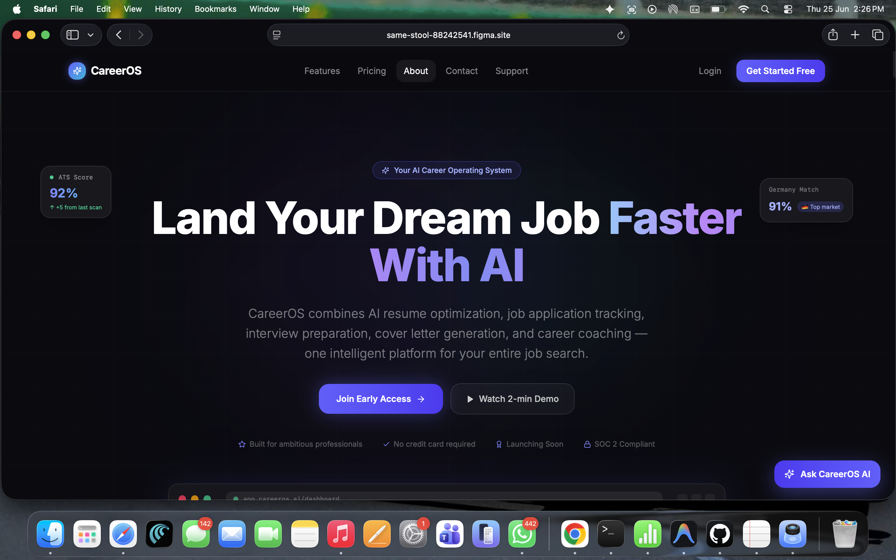
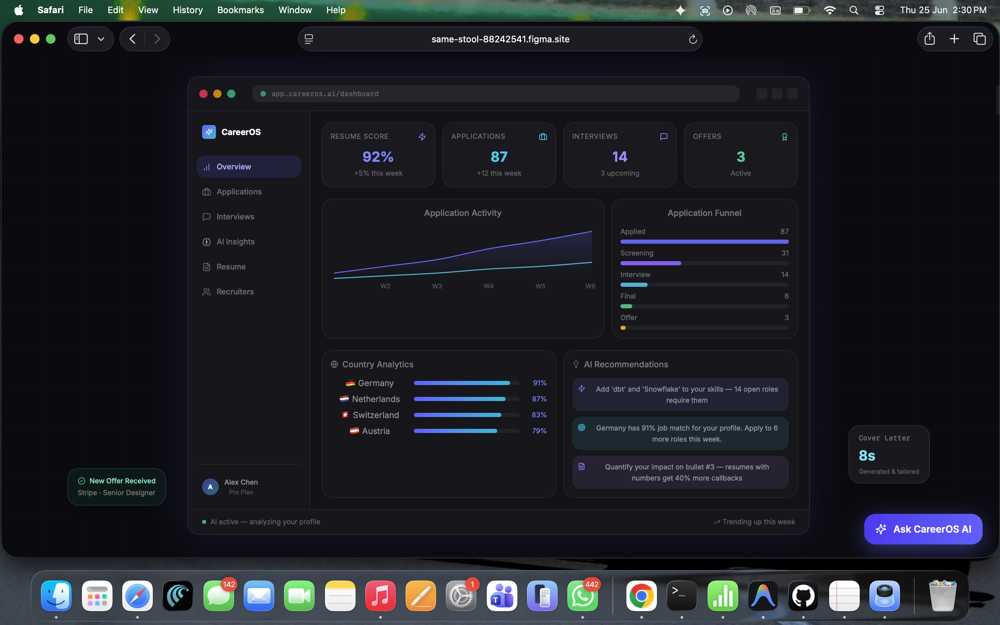
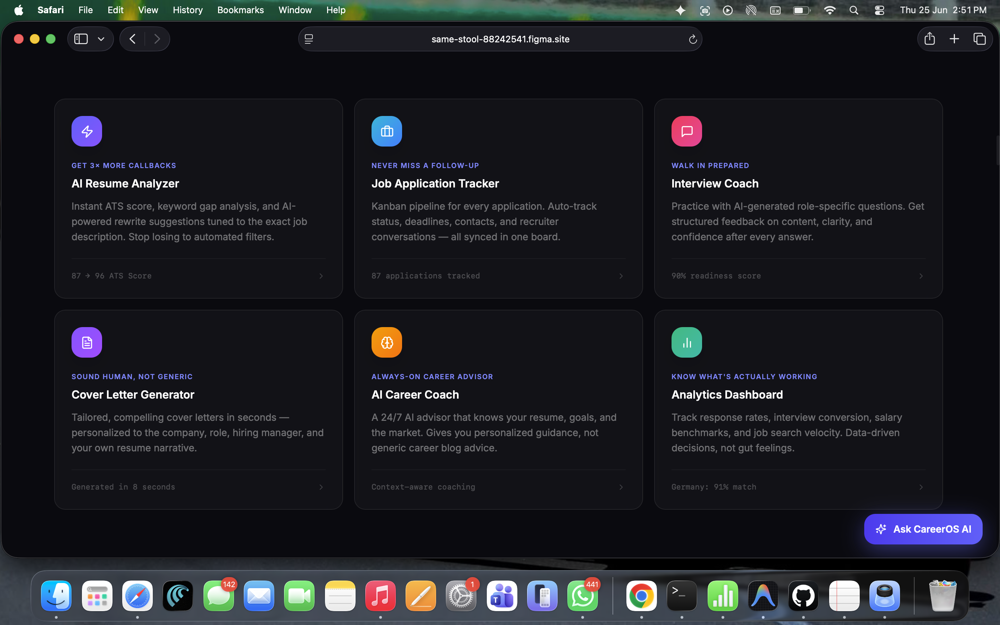
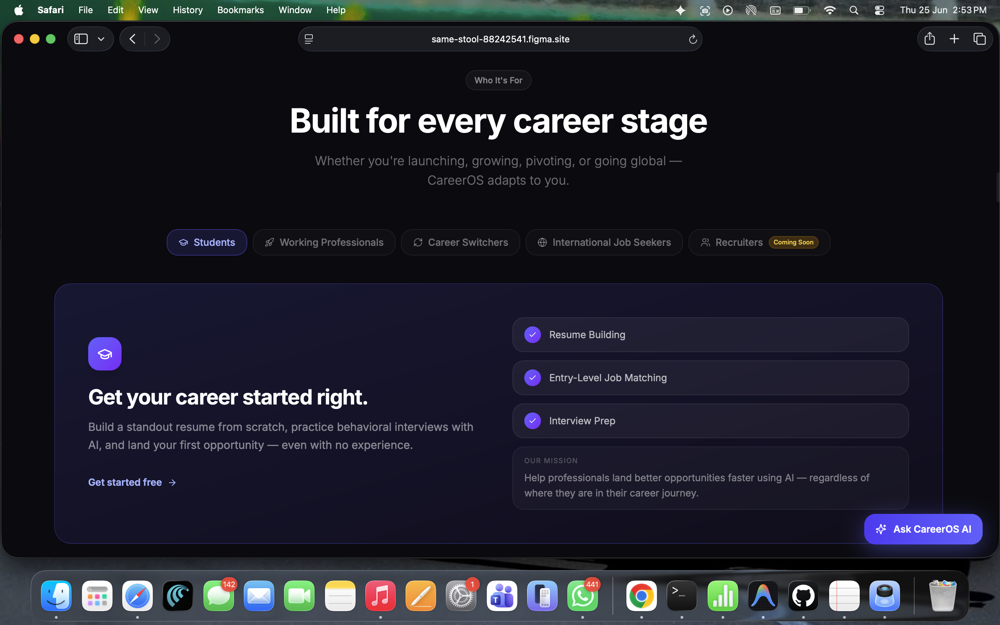
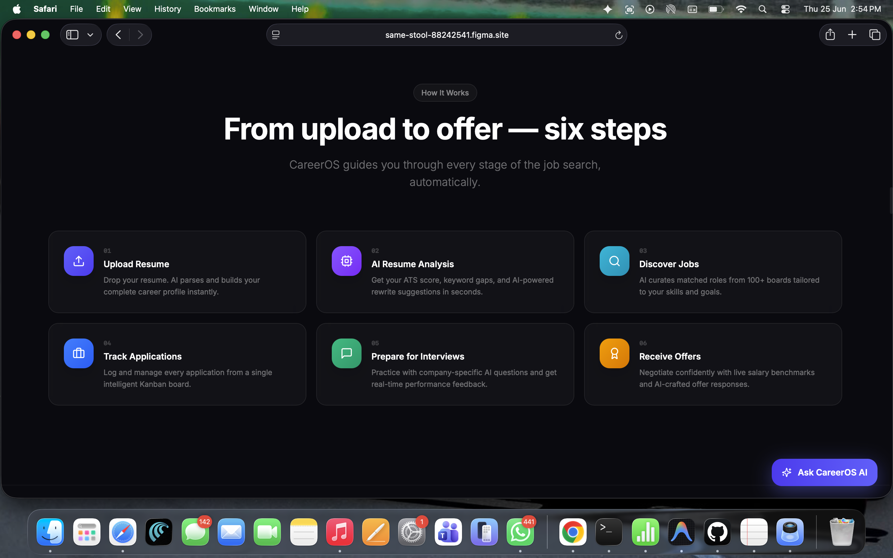
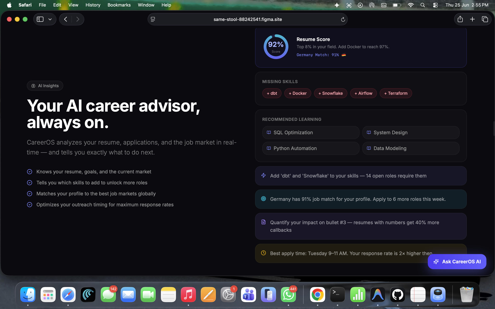
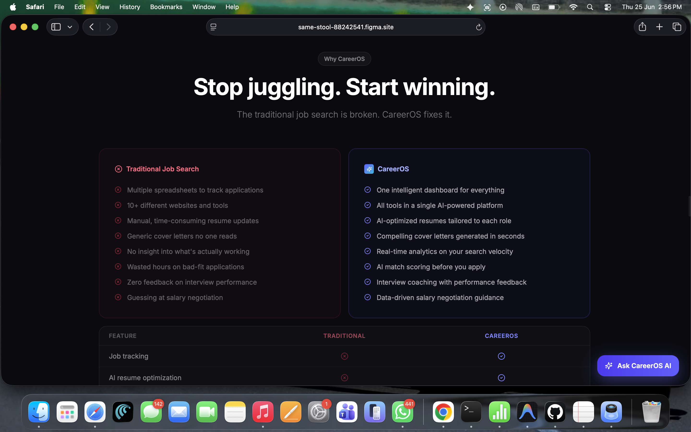
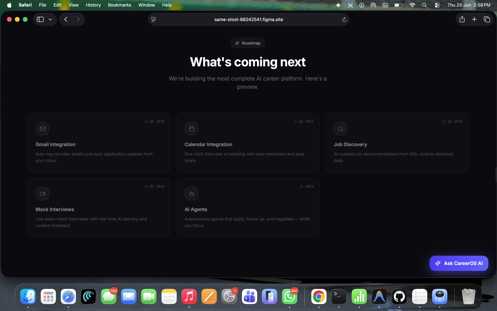
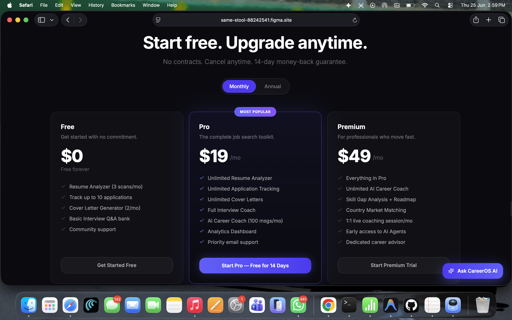
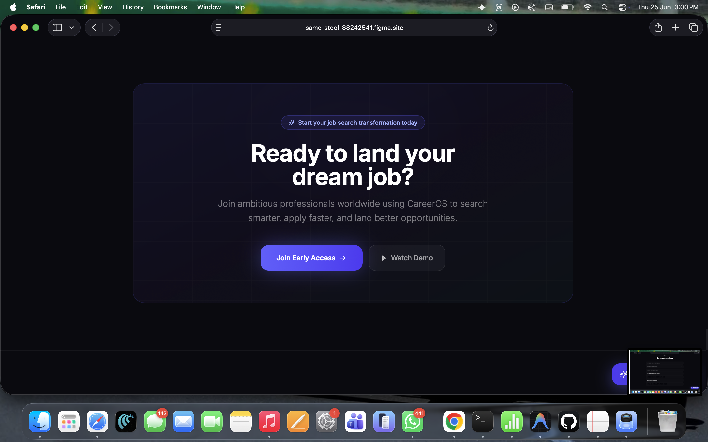

# 🚀 CareerOS

> **AI-Powered Career Operating System**
>
> An intelligent career platform that combines resume optimization, AI career coaching, job application tracking, interview preparation, and analytics into one seamless experience.

---

## 🌐 Live Demo

### 🎨 Interactive Figma Prototype

https://same-stool-88242541.figma.site/

---

# 📖 Overview

CareerOS is an AI-powered platform designed to simplify the entire job search journey.

Instead of switching between LinkedIn, Indeed, ChatGPT, Google Docs, Excel trackers, email, and interview preparation websites, CareerOS brings everything together into one intelligent dashboard.

The platform helps job seekers:

* Build ATS-friendly resumes
* Improve resume scores with AI
* Generate personalized cover letters
* Track job applications
* Prepare for interviews
* Receive AI-powered career guidance
* Analyze job search performance
* Discover skill gaps
* Match profiles with global job markets

---

# 🎯 The Problem

Today's professionals use multiple disconnected tools throughout their job search.

* LinkedIn
* Indeed
* ChatGPT
* Resume documents
* Google Docs
* Excel trackers
* Calendar
* Email

Managing everything separately wastes time and causes opportunities to be missed.

CareerOS solves this by creating a single AI-powered career operating system.

---

# ✨ Core Features

* 🤖 AI Resume Analyzer
* 📄 ATS Resume Score
* 💼 Job Application Tracker
* 🎤 AI Interview Coach
* 📝 Cover Letter Generator
* 📊 Career Analytics Dashboard
* 🧠 AI Career Coach
* 🌍 Global Job Market Matching
* 📈 Smart Career Recommendations

---

# 📸 Product Screenshots

## 1. Landing Page

---

## 2. Dashboard Overview

---

## 3. Core Features

---

## 4. User Personas

---

## 5. User Journey

---

## 6. AI Career Advisor

---

## 7. CareerOS vs Traditional Job Search

---

## 8. Product Roadmap

---

## 9. Pricing Plans

---

## 10. Call to Action

---

# 🛠 Built With

### Design

* Figma
* UI/UX Design
* Product Design

### AI Product Concepts

* Resume Optimization
* ATS Scoring
* Career Intelligence
* AI Coaching
* Analytics Dashboard

---

# 🚀 Future Roadmap

* Resume Upload
* AI Resume Analysis
* Gmail Integration
* Calendar Integration
* AI Job Matching
* AI Agents
* Recruiter Dashboard
* Mock Interviews
* Salary Negotiation Assistant

---

# 👩‍💻 Author

**Manasi Rawas**

Data Analytics • AI • Data Science • Product Design

LinkedIn:

https://www.linkedin.com/in/manasi-rawas-analytics/

---

## ⭐ If you like this project

Please consider giving it a **Star ⭐** on GitHub.
